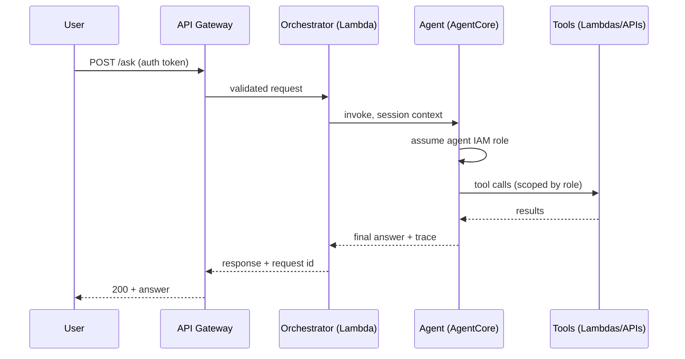

# Architecture: Production AI Agents on AWS

This document describes the reference architecture for running AI agents in
production on AWS. It reflects patterns that recur across enterprise
engagements — the things pilots skip and production demands.

## 1. Components

### Agent runtime — Amazon Bedrock AgentCore
Agents run on a managed runtime so the team focuses on tools, prompts, and
policy rather than servers. Each agent is a distinct deployable with its own
configuration, model version, and IAM role.

### Identity — one IAM role per agent
This is the single most important production decision:

- Every agent assumes **its own IAM role**. No shared credentials, no
  long-lived keys.
- Policies are scoped to the exact tools the agent may call (least privilege).
- Cross-account access goes through role assumption with external IDs, so the
  security team can audit exactly which agent touched which resource.
- Human-in-the-loop steps (approvals, payments, data exports) are modeled as
  separate roles that the agent can *request* but never assume directly.

### API & orchestration — API Gateway + Lambda
API Gateway is the front door (auth, throttling, WAF). A thin Lambda
orchestrator handles request validation, session management, and routing to
the agent runtime. Business logic stays out of the agent; the agent does
reasoning and tool use.

### Data — S3 data lake, KMS-encrypted
All training/eval/reference data lives in S3 with SSE-KMS. Raw zones are
immutable; curated zones hold obfuscated data (see §4). Bucket policies deny
unencrypted uploads.

### Models — versioned and gated
- Model IDs are pinned per environment; nothing floats on `latest`.
- Every model change passes an evaluation gate (accuracy, refusal behavior,
  latency, cost) before promotion.
- The previous version stays deployed for instant rollback.

### Observability — CloudWatch
Structured logs per agent turn (input hash, tools called, tokens, latency,
cost), distributed traces across the orchestrator → agent → tools chain, and
dashboards for quality (task success rate, escalation rate) alongside cost.

## 2. Request flow

## 3. Regression testing for AI apps

Traditional API tests assert on status codes. Agent tests assert on
**behavior**:

- **Deterministic checks** — output schema validation, refusal on
  out-of-policy requests, citation presence for RAG answers.
- **Statistical checks** — eval suites run on every model/prompt change;
  promotion requires the new version to beat the baseline on the eval set.
- **Budgets** — p95 latency and cost-per-task budgets fail the build.
- **Tooling** — Playwright drives the full user journey (login → ask →
  verify answer renders and the trace was recorded). See `tests/`.

Run the suite in CI on every change to prompts, tools, or model versions —
not just on code changes.

## 4. Data obfuscation for cloud onboarding

Regulated enterprises can't lift raw PII/PHI into the cloud. The reference
pattern:

1. **Classify** at the source (column-level tags in the on-prem inventory).
2. **Tokenize or mask** in a controlled on-prem step before transfer —
   format-preserving tokens for fields the model needs structurally
   (e.g., dates shifted by a fixed offset), irreversible masks for the rest.
3. **Land obfuscated data** in the raw S3 zone; keep the token vault on-prem.
4. **Re-identify only** in the serving path, inside the VPC, under the
   agent's scoped IAM role — never in training data.

## 5. Governance checklist

- [ ] Agent IAM roles reviewed by security; no `*` actions.
- [ ] Model versions pinned; eval gate in the promotion pipeline.
- [ ] Playwright regression suite green in CI.
- [ ] PII handling reviewed; obfuscation verified on samples.
- [ ] Cost and quality dashboards visible to the owning team.
- [ ] Incident runbook: who rolls back the model, who revokes the role.
- [ ] Human-in-the-loop defined for irreversible actions.

## 6. What this repo gives you

The `cdk/` directory is a starter skeleton implementing the account
scaffolding: agent IAM roles, encrypted buckets, log groups, and the API
Gateway stub. The `tests/` directory shows the Playwright pattern. Extend
both — the value is in the patterns, and the patterns transfer.
